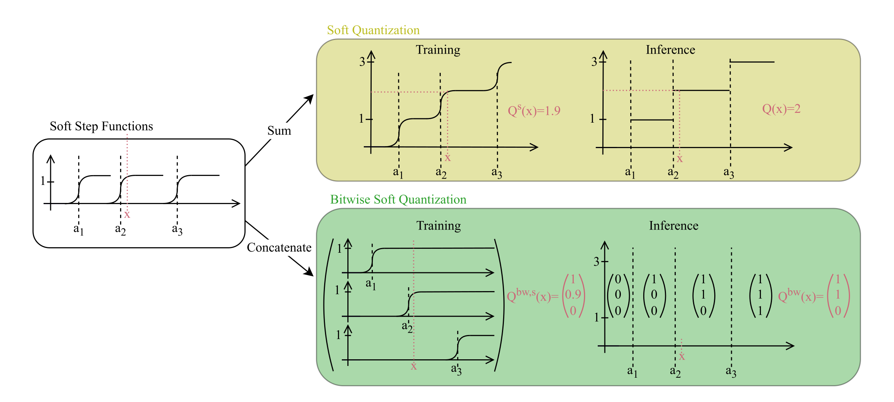

# Trainable Bitwise Soft Quantization for Input Feature Compression

[Karsten Schrödter](https://mlde-lab.github.io/team/karsten-schroedter/), [Jan Stenkamp](https://www.wi.uni-muenster.de/de/institut/dasc/personen/jan-stenkamp), [Nina Herrmann](https://mlde-lab.github.io/team/nina-herrmann/), [Fabian Gieseke](https://mlde-lab.github.io/team/fabian-gieseke/) 



This is the official repository for the Paper **Trainable Bitwise Soft Quantization for Input Feature Compression**, to be published at the *Third Conference on Parsimony and Learning (CPAL) 2026*. The repository contains the code for our work on trainable feature quantization for edge–cloud neural networks. We propose a differentiable quantization layer that compresses input features on-device using learnable thresholds and user-defined bit widths. The method reduces communication costs while preserving accuracy and consistently outperforms standard quantization baselines across multiple datasets.

## Experiments

In order to reproduce the results from the paper, please follow the steps below: 

### Hyperparameter Tuning
For Hyperparameter-Tuning, please use `hyperparameter_tuning.py` by calling 

```python3 hyperparameter_tuning.py --dataset {dataset to use} --scratch {folder where data can be stored} --n_steps {Number of hyperparameter settings tested, defaults to 100} -- n_bits {bit width to use} --result_folder {folder where results should be stored}```

The datasets used in the experiments of the paper are `[ "california",  "cpu_act",  "fried",  "sulfur",  "superconduct",  "wine_quality"]`. The results of each hyperparameter tuning are stored in `results/{dataset}/{dataset}_hyperparameter_tuning_{n_bits}bits_{4*n_steps}iterations.csv`. Per hyperparameter setting, it contains 4 columns (one per 4-fold iteration) with the hyperparameters of the setting and the training and validation losses (MSE) for all methods tested.  

### Testing Best Hyperparameter Settings

After Hyperparameter-Tuning, the best hyperparameter setting per dataset, method and bit widths is tested using `best_hyperparameter_testing_multiple.py` by calling 

```python3 best_hyperparameter_testing_multiple.py --dataset {dataset to use} --scratch {folder where data can be stored} --n_steps {Number of runs per bit width, defaults to 10} --result_folder {folder where results should be stored}```

The result-files of Hyperparameter Tuning serve as input and the results are stored in `results/best_hyperparameter_multiple/{dataset}_best_hyperparameter_test_multiple.csv`. Per bit width, it contains `n_steps` rows with the best hyperparameter setting per method and validation losses (MSE) for different data splits and model initializations. 

## Result analysis

In order to evaluate the results from `best_hyperparameter_testing_multiple.py`, scripts to provide plots and tables are stored in `result_analysis/`.

### Create Plots

Plotting can be called with `result_analysis/line_and_box_plot_cummulative.py --[no-]lineplot --[no-]boxplot`. 

- Example for lineplot: Figure 4 in Paper
- Example for boxplot: Figure 6 in Paper (Appendix)

### Create Tables

Tables can be created with `result_analysis/create_result_tables.py`

- Tables created here: Table 2, Table 9 - 11 in Paper

## Reproduction
Other software versions might also work but are not tested. Only compatible with UNIX Systems.
1. load GCC (12.3.0) 
2. load PyTorch 2.1.2 for CUDA 12.1 (recommended - works also without CUDA)
3. Use your favorite tool to execute multiple experiments (e.g. bash with bit as parameter). Note that experiments might run for several days for a bit and single dataset configuration. In case you want to test a small run add the `--debug` flag (e.g. reduces the hidden_neurons to 10). 
```bash
datasets=("california" "cpu_act"  "fried"  "sulfur"  "superconduct"  "wine_quality")
timestamp=$(date +%s)
for i in {2..8}; do
num_bits=$i
for dataset in "${datasets[@]}"; do
python3 hyperparameter_tuning.py --dataset $dataset --n_bits $num_bits --n_steps 100 --scratch {folder where data can be stored} --result_folder {folder where results should be stored} > {file for output}
done
done
```

## Acknowledgements

This work was funded by the German Federal Ministry for the Environment, Nature Conservation, Nuclear Safety and Consumer protection, Project **TinyAIoT**, Funding Nr. 67KI32002A. 

<!-- ## Citing the paper

Please cite using the following BibTex:

```
@inproceedings{
schrodter2026trainable,
title={Trainable Bitwise Soft Quantization for Input Feature Compression},
author={Karsten Schr{\"o}dter and Jan Stenkamp and Nina Herrmann and Fabian Gieseke},
booktitle={The Third Conference on Parsimony and Learning (Proceedings Track)},
year={2026},
url={https://openreview.net/forum?id=AhrDRUlzeD}
}
``` -->